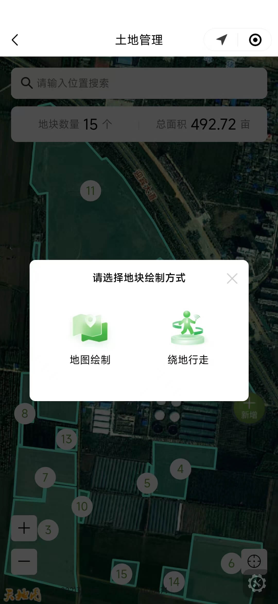
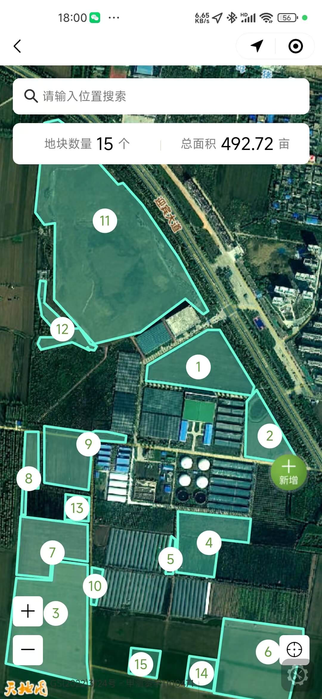
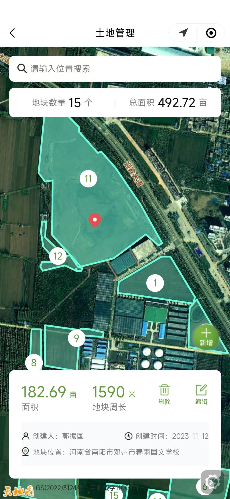
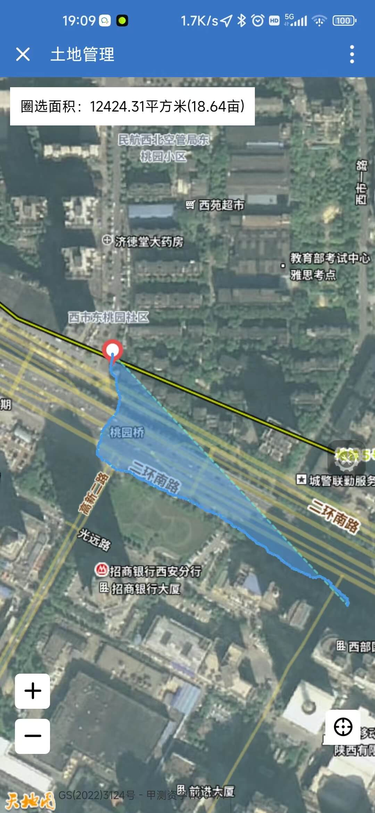
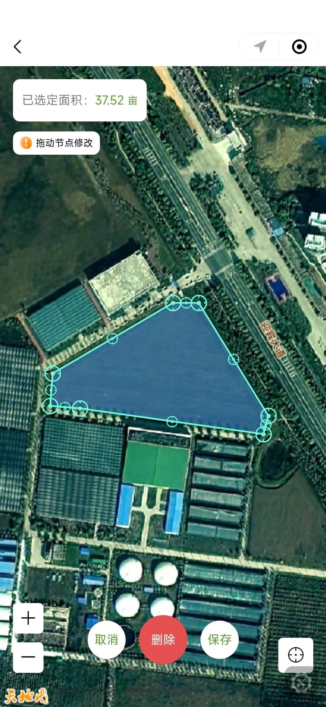

# 在Vue项目中使用天地图（二）

本片文章是自己之前做的一个智慧农业项目的总结，采用Vue2.0+H5开发, 主要实现的功能是包括地块的管理功能，使用天地图完成地图展示、地图交互、地图标注、轨迹展示、坐标点位编辑等。天地图官方文档[天地图官方文档](https://api.tianditu.gov.cn/api.html)

```js
<template>
  <div class="map-area">
    <div class="map-container" id="map-container"></div>
  </div>
</template>

<script>
export default {
  data() {
    return {
      polygon_layers: [],
      map_layer: null,
      marker_layer: null, 
      number_overlays: []
    };
  },
  mounted() {
      this.initMap();
  },
  methods: {
    // 初始化卫星地图
    initMap() {
      const zoom = 10;
      const center = new window.T.LngLat(116.39131, 39.90705);
      this.map_layer = new window.T.Map("map-container");
      this.map_layer.centerAndZoom(center, zoom);
      this.map_layer.addControl(TMAP_HYBRID_MAP);
      this.map_layer.disableDoubleClickZoom();
    },
    // 初始化路线轨迹图层
    initPolylineLayer() {
      this.polyline_layer = new T.Polyline([], {
        color: "#6CFCDC",
        weight: 2,
        lineStyle: "solid"
      });
      this.map_layer.addOverLay(this.polyline_layer);
      this.polyline_layer.setLngLats([]);
    },
    // 初始化多边形图层
    initPolygonLayer(land_id, positions) {
      const polygon_layer = new window.T.Polygon([], {
        color: "#6CFCDC",
        weight: 3,
        opacity: 1,
        fillColor: "#6CFCDC",
        fillOpacity: 0.3
      });
      this.map_layer.addOverLay(polygon_layer);
      polygon_layer.setLngLats(positions);
      this.polygon_layers.push({
        land_id,
        layer: polygon_layer
      });
    },
    // 多边形点击事件
    clickEvent() {
      this.polygon_layers.forEach((item, index) => {
        item.layer.addEventListener("click", e => {
          this.is_click_polygon = true;
          this.polygon_layers.forEach(val => {
            val.layer.setFillOpacity(0.3);
          });
          this.addOrUpdateMarker(e.lnglat);
          item.layer.setFillOpacity(0.5);
        });
      });
    },
    // 为当前点击的地块增加指示icon
    addOrUpdateMarker(lnglat) {
      const icon = new window.T.Icon({
        iconUrl: this.current_land_icon,
        iconSize: new window.T.Point(22, 24)
      });
      if (this.marker_layer) {
        this.marker_layer.setLngLat(lnglat);
      } else {
        this.marker_layer = new T.Marker(lnglat, { icon, zIndexOffset: 5000 });
        this.map_layer.addOverLay(this.marker_layer);
      }
    },
    // 为当前位置添加指示marker
    setLocationMarker(longitude, latitude) {
      if (this.current_location_marker) {
        this.map_layer.removeOverLay(this.current_location_marker);
        this.current_location_marker = null;
      }
      const icon = new window.T.Icon({
        iconUrl: this.current_icon,
        iconSize: new window.T.Point(24, 31)
      });
      const current_lnglat = new window.T.LngLat(longitude, latitude);
      if (current_lnglat) {
        this.map_layer.panTo(current_lnglat, 18);
        this.current_location_marker = new T.Marker(current_lnglat, { icon, zIndexOffset: 1001 });
        this.map_layer.addOverLay(this.current_location_marker);
      }
    },

    // 清除图层
    removeOverlays() {
      this.polygon_layers.forEach(item => {
        this.map_layer.removeOverLay(item.layer);
      });
      this.polygon_layers = [];
      if (this.marker_layer) {
        this.map_layer.removeOverLay(this.marker_layer);
        this.marker_layer = null;
      }
      this.number_overlays.forEach(layer => {
        this.map_layer.removeOverLay(layer);
      });
      this.number_overlays = [];
    },
    // 自定义标注
    initNumberOverlays() {
      const map = this.map_layer;
      this.number_overlays = center_points.map(item => {
        const layer = new definedOverlay({
          width: 30,
          height: 30,
          background: "#fff",
          lnglat: item.lnglat,
          zIndex: 1000,
          radius: 30,
          color: "#609E39",
          fontSize: item.short_land_sn > 99 ? 14 : 16,
          text: item.short_land_sn,
          map,
          isBorder: false
        });
        map.addOverLay(layer);
        return layer;
      });
    },
    // 获取两个经纬度坐标中心的经纬度
    getMiddleLatLng(position0, position1) {
      let lat, lng;
      const lat_difference = position0.lat - position1.lat;
      const lng_difference = position0.lng - position1.lng;
      if (lat_difference > 0) {
        lat = Number(position0.lat) - Math.abs(lat_difference) / 2;
      } else {
        lat = Number(position1.lat) - Math.abs(lat_difference) / 2;
      }
      if (lng_difference > 0) {
        lng = Number(position0.lng) - Math.abs(lng_difference) / 2;
      } else {
        lng = Number(position1.lng) - Math.abs(lng_difference) / 2;
      }
      return new window.T.LngLat(lng, lat);
    },
    // 计算两条线段的夹角
    calcLineAngle(lat1, lon1, lat2, lon2, lat3, lon3, lat4, lon4) {
      // 计算第一条线段的向量
      const x1 = lon2 - lon1;
      const y1 = lat2 - lat1;
      // 计算第二条线段的向量
      const x2 = lon4 - lon3;
      const y2 = lat4 - lat3;
      // 计算两个向量的点积
      const dot = x1 * x2 + y1 * y2;
      // 计算两个向量的长度
      const len1 = Math.sqrt(x1 * x1 + y1 * y1);
      const len2 = Math.sqrt(x2 * x2 + y2 * y2);
      // 计算夹角（弧度）
      const angleRad = Math.acos(dot / (len1 * len2));
      // 将弧度转换为角度
      const angleDeg = (angleRad * 180) / Math.PI;
      return angleDeg;
    },
  }
}
<style lang="less" scoped>
.map-area {
  width: 100vw;
  height: 100vh;
  .map-container {
    width: 100%;
    height: 100%;
  }
}
</style>
```
+ tool.js 处理坐标点位工具函数

```js
import coordtransform from "coordtransform";

/**
 * 自定义标注或覆盖物实体类
 * @returns 返回天地图自定义覆盖物对象
 */
export const definedOverlay = window.T.Overlay.extend({
  initialize: function(options) {
    this.width = options.width;
    this.height = options.height;
    this.url = options.url;
    this.background = options.background || "transparent";
    this.lnglat = options.lnglat;
    this.padding = options.padding || 0;
    this.rotateDeg = options.rotateDeg || 0;
    this.zIndex = options.zIndex;
    this.offset = options.offset || new window.T.Point(0, 0);
    this.radius = options.radius || 0;
    this.fontSize = options.fontSize || 14;
    this.text = options.text || "";
    this.color = options.color || "#000";
    this.isBorder = options.isBorder || false;
    this.map = options.map;
  },
  onAdd: function() {
    let element;
    if (this.url) {
      element = this.element = document.createElement("img");
    } else {
      element = this.element = document.createElement("div");
    }
    const { x, y } = this.offset;
    element.className = "label-text";
    element.innerText = this.text;
    element.style.display = "inline-block";
    element.style.position = "absolute";
    element.style.zIndex = this.zIndex;
    element.style.width = this.width ? this.width + "px" : "auto";
    element.style.height = this.height ? this.height + "px" : "auto";
    element.style.lineHeight = this.height ? this.height + "px" : "auto";
    element.style.borderRadius = this.radius + "px";
    element.style.transformOrigin = `center`;
    element.style.background = this.background;
    element.style.textAlign = "center";
    element.style.fontSize = this.fontSize + "px";
    element.style.color = this.color;
    element.style.whiteSpace = "nowrap";
    element.style.MozUserSelect = "none";
    element.style.userSelect = "none";
    element.setAttribute("draggle", true);
    element.style.transform = `translate3d(${x}px, ${y}px, 0) rotate(${this.rotateDeg}deg)`;
    element.style.transformOrigin = "top";
    if (this.isBorder) {
      element.style.border = "1px solid #000";
    }
    if (this.padding && this.padding.length) {
      element.style.paddingTop = this.padding[0] ? this.padding[0] + "px" : "0px";
      element.style.paddingRight = this.padding[1] ? this.padding[1] + "px" : "0px";
      element.style.paddingBottom = this.padding[2] ? this.padding[2] + "px" : "0px";
      element.style.paddingLeft = this.padding[3] ? this.padding[3] + "px" : "0px";
    }
    if (this.url) {
      element.setAttribute("src", this.url);
    }
    element.addEventListener(
      "contextmenu",
      function(e) {
        e.preventDefault();
        e.stopPropagation();
      },
      false
    );
    this.map.getPanes().overlayPane.appendChild(this.element);
    this.update(this.lnglat, this.rotateDeg);
  },
  onRemove: function() {
    const parent = this.element.parentNode;
    if (parent) {
      parent.removeChild(this.element);
      this.element = null;
    }
  },
  setLngLat: function(lnglat) {
    this.lnglat = lnglat;
    this.update();
  },
  setAngle: function(rotateDeg) {
    this.rotateDeg = rotateDeg;
    this.update();
  },
  getLnglat: function() {
    return this.lnglat;
  },
  setPos: function(pos) {
    this.lnglat = this.map.layerPointToLngLat(pos);
    this.update();
  },
  setColor(color) {
    this.color = color;
    this.element.style.color = color;
  },
  setBackground(background) {
    this.background = background;
    this.update();
    // this.element.style.background = background;
  },
  setFontSize(size) {
    this.fontSize = size;
    this.update();
    // this.element.style.fontSize = size + "px";
  },
  update: function() {
    const pos = this.map.lngLatToLayerPoint(this.lnglat);
    const offset_x = this.element.offsetWidth / 2;
    const offset_y = this.element.offsetHeight / 2;
    this.element.style.left = pos.x - offset_x + "px";
    this.element.style.top = pos.y - offset_y + "px";
    this.element.style.color = this.color;
    this.element.style.background = this.background;
    this.element.style.fontSize = this.size + "px";
    const { x, y } = this.offset;
    this.element.style.transform = `translate3d(${x}px, ${y}px, 0) rotate(${this.rotateDeg}deg)`;
  }
});

/**
 * 计算一个点到一条线段的距离
 * @param {Object} p - 点对象，包含 x 和 y 属性, x:经度 y:纬度
 * @param {Object} p1 - 线段起点对象，包含 x 和 y 属性, x:经度 y:纬度
 * @param {Object} p2 - 线段终点对象，包含 x 和 y 属性, x:经度 y:纬度
 * @return {Number} 点到线段的距离
 */
function distance(p, p1, p2) {
  // 计算三角形的面积，这里使用了向量的叉积
  var area = Math.abs(0.5 * (p1.x * p2.y + p2.x * p.y + p.x * p1.y - p2.x * p1.y - p.x * p2.y - p1.x * p.y));
  // 计算线段的长度
  var bottom = Math.sqrt(Math.pow(p1.x - p2.x, 2) + Math.pow(p1.y - p2.y, 2));
  // 计算距离
  var height = (area / bottom) * 2;
  return height;
}

/**
 * 计算经纬度坐标区域内中心点坐标
 * @param {Array} coordinates -经纬度坐标数组[[longitude1,latitude1],[longitude2,latitude2]...]
 * @returns 返回中心点坐标 [centerLng, centerLat]
 */
export function getCenterPoint(coordinates) {
  // 计算经度和纬度的平均值
  var sumLat = 0; // 纬度总和
  var sumLng = 0; // 经度总和
  var numPoints = coordinates.length; // 坐标点数量
  for (var i = 0; i < numPoints; i++) {
    sumLat += coordinates[i][1]; // 累加纬度
    sumLng += coordinates[i][0]; // 累加经度
  }
  var centerLat = sumLat / numPoints; // 计算平均纬度
  var centerLng = sumLng / numPoints; // 计算平均经度

  // 调整经度坐标，使其位于 [-180, 180] 的范围内
  if (centerLng > 180) {
    centerLng -= 360;
  } else if (centerLng < -180) {
    centerLng += 360;
  }

  return [centerLng, centerLat]; // 返回中心点坐标
}

/**
 * 计算两个经纬度坐标点之间线段的旋转角度
 * @param {number} lat1 - 第一个坐标点的纬度
 * @param {number} lon1 - 第一个坐标点的经度
 * @param {number} lat2 - 第二个坐标点的纬度
 * @param {number} lon2 - 第二个坐标点的经度
 * @returns {number} 旋转角度，以度数表示
 */
export function getRotationAngle(lat1, lon1, lat2, lon2) {
  // 将经纬度坐标转换为弧度
  var radLat1 = (lat1 * Math.PI) / 180;
  var radLon1 = (lon1 * Math.PI) / 180;
  var radLat2 = (lat2 * Math.PI) / 180;
  var radLon2 = (lon2 * Math.PI) / 180;

  // 将经纬度坐标转换为笛卡尔坐标系中的坐标点
  var x1 = Math.cos(radLat1) * Math.cos(radLon1);
  var y1 = Math.cos(radLat1) * Math.sin(radLon1);
  var x2 = Math.cos(radLat2) * Math.cos(radLon2);
  var y2 = Math.cos(radLat2) * Math.sin(radLon2);

  // 计算两个坐标点之间的斜率
  var dx = x2 - x1;
  var dy = y2 - y1;
  var slope = dy / dx;

  // 根据斜率计算旋转角度
  var angle = Math.atan(slope) * (180 / Math.PI);

  return angle;
}

/**
 * @return 返回计算两个经纬度点之间直线方程斜率和截距
 */
export function getSlopeAndIntercept(position1, position2) {
  const slope = (position2.lng - position1.lng) / (position2.lat - position1.lat);
  const intercept = position1.lng - slope * position1.lat;
  return { slope: slope, intercept: intercept };
}

/**
 * 根据两点坐标计算线段的旋转角度
 * @return angle_deg 旋转角度
 */
export function caculateAngleFromCoordinate(position1, position2) {
  const p1 = {
    x: position1.lat,
    y: position1.lng
  };

  const p2 = {
    x: position2.lat,
    y: position2.lng
  };
  const angle_deg = Math.atan2(p2.y - p1.y, p2.x - p1.x);
  return angle_deg;
}

/**
 * GCJ-02经纬度坐标转换为WGS84坐标
 * @param lng  经度
 * @param lat 纬度
 * @return wgs84坐标
 */
export const transferCoordinate = (lng, lat) => {
  const wgs84 = coordtransform.gcj02towgs84(lng, lat);
  return wgs84;
};

/**
 * 使用 道格拉斯-普克(Douglas-Peuker)轨迹抽希算法对点集进行抽稀
 * @param {Array} points - 点集数组，每个点是一个对象，包含x和y,x:经度 y:纬度
 * @param {Number} epsilon - 抽稀的距离阈值
 * @return {Array} 抽稀后的点集数组
 */
export function douglasPeucker(points, epsilon) {
  // 记录距离最大的点的索引和距离
  var maxDistance = 0;
  var index = 0;
  // points 数组的最后一个点是固定不变的，因为它肯定是折线的一个端点
  var end = points.length - 1;
  var d;

  // 找到距离最远的点
  for (var i = 1; i < end; i++) {
    d = distance(points[i], points[0], points[end]);
    if (d > maxDistance) {
      index = i;
      maxDistance = d;
    }
  }

  // 如果距离最大的点距离大于阈值，说明还可以抽稀
  if (maxDistance > epsilon) {
    // 将点集分成两个部分，分别递归抽稀
    var left = points.slice(0, index + 1);
    var right = points.slice(index);

    var rResults = douglasPeucker(right, epsilon);
    var lResults = douglasPeucker(left, epsilon);

    // 将两部分结果合并
    return lResults.slice(0, lResults.length - 1).concat(rResults);
  } else {
    // 如果距离最大的点距离小于等于阈值，说明不能再抽稀了
    // 直接返回起点和终点，这两个点肯定要保留
    return [points[0], points[end]];
  }
}

```

## 主要功能展示(图片)
<div style="display: flex;">
  
  
  
  
  
</div>