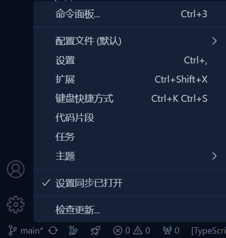

# 快捷键

+ 在写代码的过程中，我们经常需要快速书写代码、移动代码、拷贝代码、删除代码、换行、缩进等操作，而 VSCode 的快捷键非常丰富，再搭配上一些插件，可以设定一些常用的快捷键，让我们在编写代码的过程中，可以事半功倍。
+ 可以通过点击设置->键盘快捷方式，进行自定义。

## 推荐vscode插件 Eclipse Keymap

+ [Eclipse Keymap](https://marketplace.visualstudio.com/items?itemName=alphabotsec.vscode-eclipse-keybindings)

## 我的常用快捷键

| 功能 | 快捷键 |
| --- | --- |
| 按名称搜索文件 | Ctrl + P |
| 快速切换文件 | Ctrl + Tab |
| 在当前页面内搜素 | Ctrl + F |
| 全局搜索 | Ctrl + Alt + F |
| 跳转到行 | Ctrl + L |
| 快速删除当前行 | Ctrl + D |
| 复制当前行并粘贴到下一行 | Ctrl + Alt + ↓ |
| 移动行 | Alt + ↑ 或 Alt + ↓ |
| 光标选中选中内容的末尾 | Shift + Alt + i |
| 跳转到行 | Ctrl + L |
| 新建文件 | Ctrl + N |
